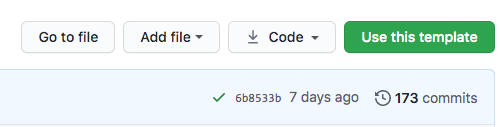

A demonstration of how to build and publish pages with the [baker](https://github.com/datadesk/baker) build tool.

The Los Angeles Times uses baker to build the static pages published at latimes.com/projects. You can use it however you'd like.

The Times system relies on a private version of a repository like this. With a little configuration, you can use this template to easily publish a page. With a little customization, you can make it look anyway you'd like.

## Links

- [baker]()
- [staging-example](http://baker-example-page-template-staging.s3-website-us-east-1.amazonaws.com/baker-example-page-template/main/)
- [production-example]()

## Getting started

The first step is to click GitHub’s “use this template” button to a make a copy of the repository for yourself.

You’ll be asked to provide a slug for your project. Once that’s done, a new repository will be available at `https://github.com/your-username/your-slug`.
